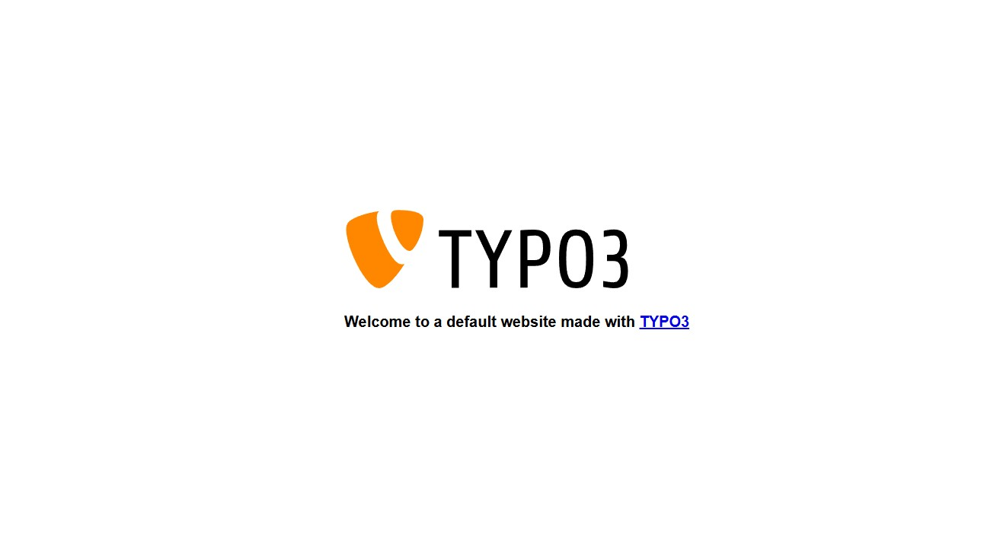
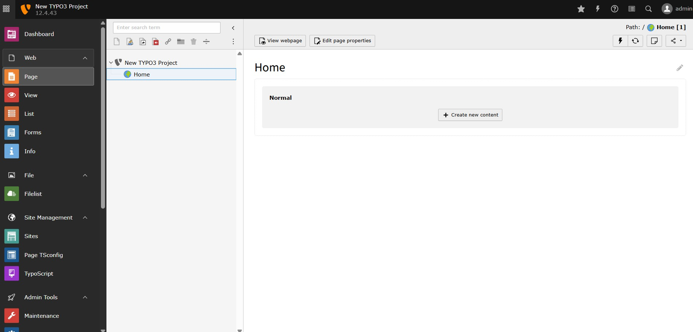

# Install Typo3 and OpenLiteSpeed

Install OpenLiteSpeed, PHP, DataBase, and Typo3 CMS. 
```
bash typo3setup.sh
```

Once done, run `/var/www/html/vendor/bin/typo3 setup` to finish the site installation.
```
Which web server is used?
  [apache] Apache
  [iis   ] Microsoft IIS
  [other ] Other (use for anything else)
 > other

Database driver?
  [mysqli        ] [MySQLi] Manually configured MySQL TCP/IP connection
  [mysqliSocket  ] [MySQLi] Manually configured MySQL socket connection
  [pdoMysql      ] [PDO] Manually configured MySQL TCP/IP connection
  [pdoMysqlSocket] [PDO] Manually configured MySQL socket connection
  [postgres      ] Manually configured PostgreSQL connection
  [sqlite        ] Manually configured SQLite connection
 > mysqli

Enter the database "username" [default: db] ? typo3
Enter the database "password" ? enter the promped credential. 
Enter the database "port" [default: 3306] ?
Enter the database "host" [default: db] ? localhost
Select which database to use:
 > typo3
Admin username (user will be "system maintainer") ?
Admin user and installer password ?
Admin user email ? test@gmail.com
Give your project a name [default: New TYPO3 Project] ?
Create a basic site? Please enter a URL [default: no]
✓ Congratulations - TYPO3 Setup is done.
```

Run the following command to ensure the file ownership is accessible by the web server.
```
chown -R www-data:www-data /var/www/html
```

Then visit the site on browser!

Typo3 Default front Page

Typo3 admin page
